# TTCS-05-2026

Data Platform E-commerce — Customer 360 Analytics.

## Kiến trúc hệ thống

### Tổng quan kiến trúc



### Luồng dữ liệu ETL Pipeline



### Mô hình dữ liệu (Star Schema)



## Key Files

- `README.md`: Tài liệu tổng quan dự án.
- `infra/docker-compose.yml`: Khởi tạo local stack (MinIO, Spark, ClickHouse, Streamlit, **Airflow**).
- `infra/start_airflow.sh`: Script khởi động toàn bộ stack và hiển thị URL các dịch vụ.
- `dags/customer360_initial_load.py`: DAG Airflow — load dữ liệu lần đầu (trigger thủ công).
- `dags/customer360_daily_etl.py`: DAG Airflow — ETL tự động mỗi 5 phút (generate data → extract → transform → load).
- `pipelines/extract.py`: Stage extract cho các nguồn SQL/API/Excel.
- `pipelines/transform.py`: Stage transform/chuẩn hóa dữ liệu.
- `pipelines/load.py`: Stage load dữ liệu vào serving layer/warehouse.
- `pipelines/run_pipeline.py`: Entry-point chạy pipeline end-to-end (chạy thủ công, ngoài Airflow).
- `warehouse/run_ddl.sql`: Entry-point chạy toàn bộ DDL ClickHouse.
- `apps/streamlit/app.py`: Entry-point dashboard Streamlit.
- `docs/ProjectOverview.md`: Đặc tả nghiệp vụ, schema và mapping.

## Folder Map (đầy đủ)

```text
TTCS-05-2026/
├── apps/                   -- ứng dụng tiêu thụ dữ liệu
│   └── streamlit/          -- dashboard Customer 360
│       ├── components/     -- UI components tái sử dụng
│       ├── pages/          -- các trang dashboard
│       └── services/       -- query layer và ClickHouse client
├── configs/                -- cấu hình tập trung pipeline/storage/warehouse
├── dags/                   -- Airflow DAGs (orchestration)
│   ├── customer360_initial_load.py  -- DAG load lần đầu (manual trigger)
│   └── customer360_daily_etl.py     -- DAG ETL tự động (*/5 * * * *)
├── data/                   -- lưu trữ Data Lake local theo zone
│   ├── raw/                -- dữ liệu thô sau ingest
│   ├── clean/              -- dữ liệu đã làm sạch/chuẩn hóa
│   ├── serving/            -- dữ liệu sẵn sàng để phục vụ phân tích
│   └── contracts/          -- schema contract và ràng buộc dữ liệu
├── data_source/            -- dữ liệu nguồn sinh bởi generate_fake_data
│   ├── api/                -- JSON data cho FastAPI source
│   └── excel/              -- file Excel nguồn
├── docs/                   -- tài liệu nghiệp vụ và kiến trúc
├── generate_fake_data/     -- script sinh dữ liệu giả
│   └── clickstream/        -- sinh log hành vi JSON
├── infra/                  -- hạ tầng local (Docker/containers)
│   ├── clickhouse/         -- cấu hình và init ClickHouse
│   │   └── init/           -- tài nguyên khởi tạo DB
│   ├── minio/              -- cấu hình object storage
│   │   └── init/           -- tài nguyên khởi tạo bucket/policy
│   ├── source-api/         -- Dockerfile FastAPI source
│   ├── source-db/          -- SQL init cho PostgreSQL source
│   └── spark/              -- cấu hình Spark processing
│       └── conf/           -- file config Spark
├── pipelines/              -- ETL orchestration cấp dự án
│   ├── sources/            -- adapter nguồn SQL/API/Excel
│   └── transforms/         -- transform theo domain nghiệp vụ
├── sample_data/            -- dữ liệu Olist gốc (CSV) để sinh fake data
├── scripts/                -- script tiện ích
├── tests/                  -- test chất lượng dữ liệu và pipeline
│   ├── smoke/              -- kiểm tra luồng chạy tối thiểu
│   ├── contracts/          -- kiểm tra schema contracts
│   └── data_quality/       -- kiểm tra rule chất lượng dữ liệu
└── warehouse/              -- schema và view cho ClickHouse
    ├── ddl/                -- định nghĩa bảng dim/fact
    └── views/              -- view phục vụ phân tích (Customer 360)
```

## Ghi chú

- Luồng chính: `extract.py` -> `transform.py` -> `load.py`.
- Orchestration bằng **Apache Airflow** — DAGs nằm tại `dags/`.
- Đặc tả nghiệp vụ và mapping dữ liệu tham chiếu tại `docs/ProjectOverview.md`.

## Chạy nhanh (Airflow — khuyến nghị)

0. Dừng tất cả containers + xóa volumes (nếu cần reset):

   ```bash
   docker compose -f infra/docker-compose.yml down -v
   ```

1. Khởi động toàn bộ stack (bao gồm Airflow):

   ```bash
   docker compose -f infra/docker-compose.yml up -d
   ```

2. Mở Airflow Web UI tại **http://localhost:8082** (login: `admin` / `admin`).

3. **Lần đầu**: Trigger DAG `customer360_initial_load` thủ công → sinh toàn bộ dữ liệu + chạy pipeline.

4. **Tự động**: Bật DAG `customer360_daily_etl` → ETL chạy tự động mỗi 5 phút.

5. (Tuỳ chọn) Kiểm tra smoke test:

   ```bash
   PYTHONPATH=. pytest -q tests/smoke/test_pipeline_layout.py
   ```

> File môi trường đã sẵn tại `infra/.env` (dựa trên `infra/.env.example`).

## Chạy pipeline thủ công (không cần Airflow)

1. Cài Python package:

   ```bash
   pip install -r requirements.txt
   ```

2. Sinh dữ liệu giả:

   ```bash
   python -m generate_fake_data.run_all
   ```

3. Khởi động infra (không Airflow):

   ```bash
   docker compose -f infra/docker-compose.yml up -d minio clickhouse source-db source-api spark streamlit
   ```

4. Chạy pipeline end-to-end:

   ```bash
   PYTHONPATH=. python -m pipelines.run_pipeline
   ```

## Truy cập dịch vụ

| Dịch vụ | URL / Host | Credentials |
|---|---|---|
| **Airflow Web UI** (Orchestration) | http://localhost:8082 | `admin` / `admin` |
| **Dashboard (Streamlit)** | http://localhost:8502 | — |
| **MinIO Console** (Data Lake) | http://localhost:9011 | `minioadmin` / `minioadmin123` |
| **MinIO S3 API** | http://localhost:9010 | (dùng chung credentials trên) |
| **ClickHouse HTTP** (Data Warehouse) | http://localhost:8124 | `default` / `ttcs` |
| **Spark UI** | http://localhost:4041 | — |
| **PostgreSQL** (Source DB) | `localhost:5434` | `source_user` / `source_pass` — DB: `ecommerce` |
| **FastAPI** (Source API) | http://localhost:8001/docs | — |

### Kết nối ClickHouse (DBeaver / CLI)

```bash
# CLI
docker exec -it ttcs-clickhouse clickhouse-client --database=ttcs --password=ttcs

# Connection string (mapped port 8124)
jdbc:ch://localhost:8124/ttcs?user=default&password=ttcs
```

### Kết nối PostgreSQL

```bash
psql -h localhost -p 5434 -U source_user -d ecommerce
# Password: source_pass
```

### Xem Data Lake (MinIO)

Mở http://localhost:9011 → đăng nhập → duyệt 3 bucket: `ttcs-raw`, `ttcs-clean`, `ttcs-serving`.

### Airflow DAGs

| DAG | Schedule | Mô tả |
|---|---|---|
| `customer360_initial_load` | Manual (trigger tay) | Sinh toàn bộ fake data + chạy ETL pipeline lần đầu |
| `customer360_daily_etl` | `*/5 * * * *` (mỗi 5 phút) | Sinh dữ liệu incremental + chạy ETL pipeline |
